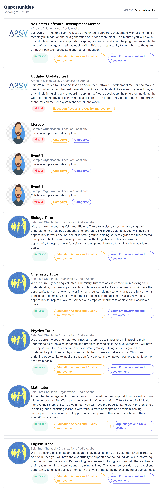
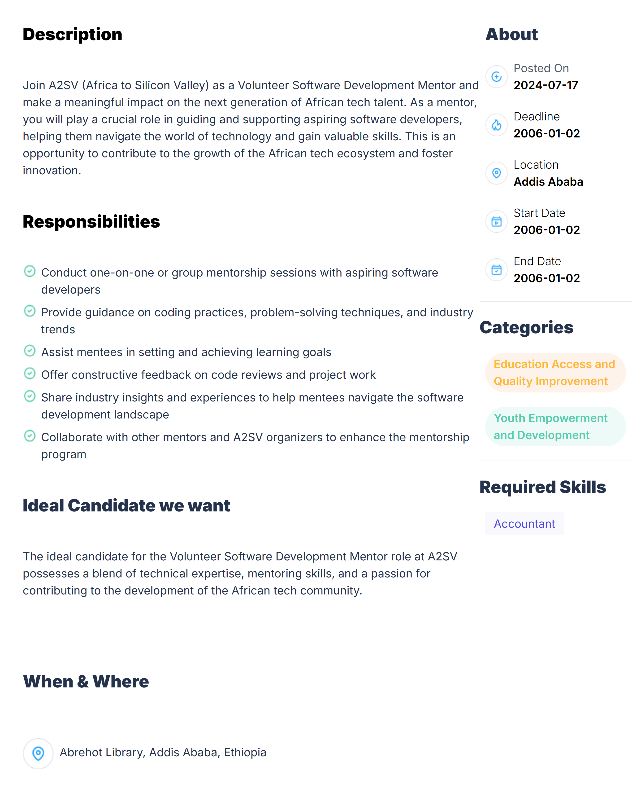

# Job Listing Application

This project is a job listing application built with React and Next.js. It demonstrates the ability to create dynamic user interfaces, handle static data, and implement responsive designs using Tailwind CSS. The application features a job listing dashboard, job detail views, and various UI components such as job cards populated with dummy data.

## Features

- **Job Card Component:** A React component that closely resembles the design provided in the task.
- **Dynamic Data Handling:** The card is populated with dummy data from a JSON file stored in the project.
- **Job Listing Dashboard:** A dashboard that lists all available job opportunities, styled using Tailwind CSS.
- **Job Details Page:** Detailed view of each job, including description, responsibilities, and other relevant information.

## Installation

To get started with this project, follow the steps below:

1. **Clone the repository:**

   ```bash
   git clone https://github.com/Rediet-W/Web_Track.git
   Navigate to the project directory:
   ```

cd Web_Track
Install dependencies:

npm install
Start the development server:

npm run dev
Open your browser and go to http://localhost:3000 to view the application.```

## Usage

The main job listing page is accessible at /jobs, where you can view the list of all job opportunities.
Click on any job title to view the detailed job description.

## Screenshots

### Job Listing Dashboard:



This page displays a list of all job opportunities available.

### Job Detail Page:


Provides a detailed view of a selected job, including its description, responsibilities, location, and required skills.
